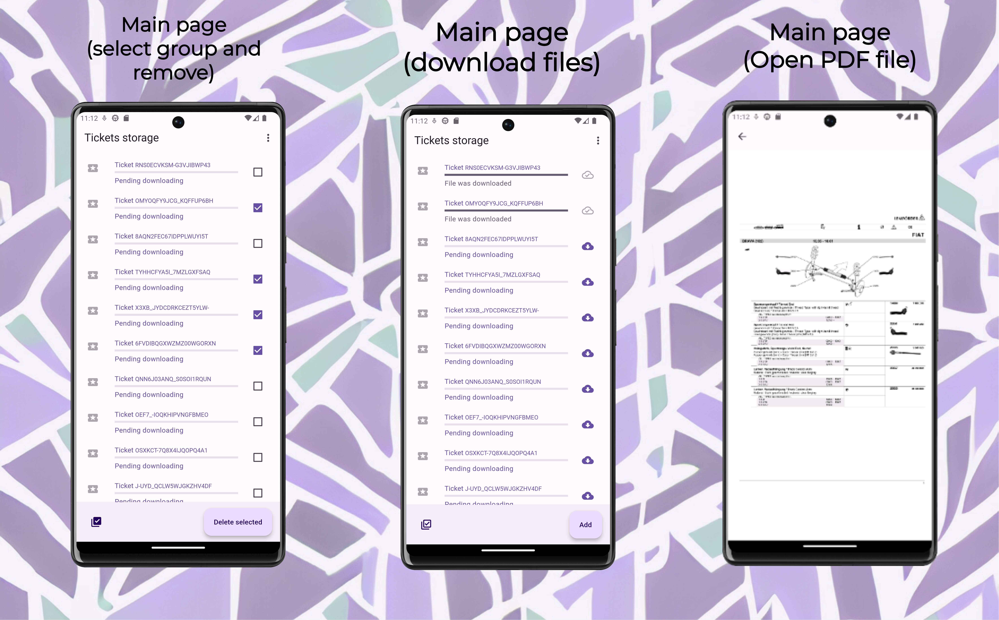
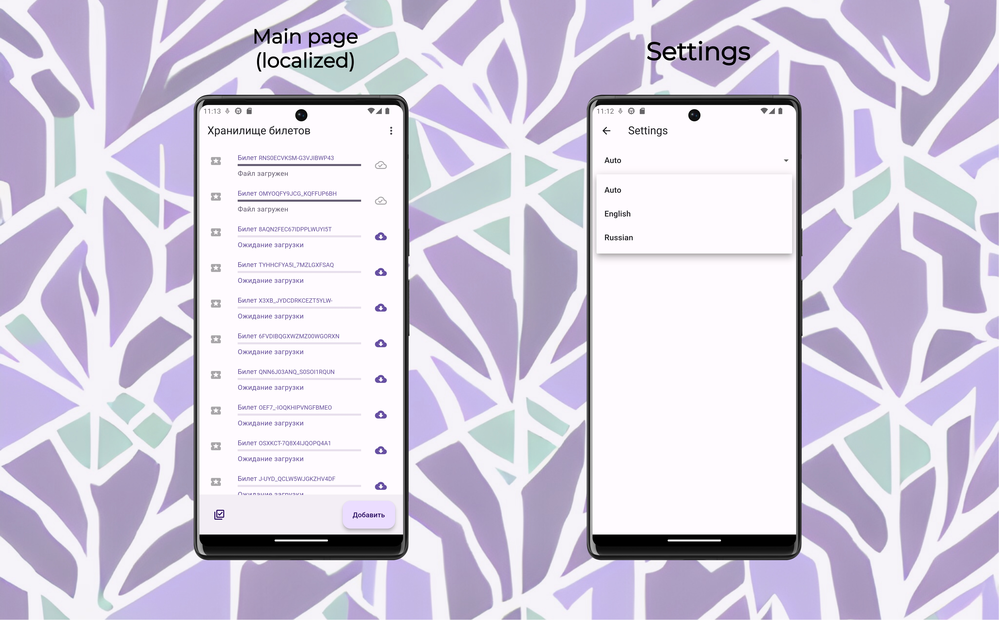

# Ticket storage (Documents storage)

## Description

A small application project where the user can differentiate between different tickets (or other files). An application can be part of something bigger such as storage for storing documents.

## Content table

- [Ticket storage (Documents storage)](#ticket-storage-documents-storage)
  - [Description](#description)
  - [Content table](#content-table)
  - [Platforms](#platforms)
  - [Stack](#stack)
  - [Features](#features)
    - [Main](#main)
    - [Tickets storage](#tickets-storage)
  - [Demonstration](#demonstration)
    - [Screenshots](#screenshots)
    - [Video screencast](#video-screencast)
  - [Useful links](#useful-links)
  - [Author contacts](#author-contacts)
  - [License](#license)

## Platforms
- Android
- IOS

## Stack
- [x] Bloc state manager;
- [x] Isar database with generators;
- [x] get_it - service locator to dependencies management;
- [x] go_router - navigation;
- [x] flutter_download_manager - to manage download and show progress;
- [x] slang - to localize app;
- [x] and others dependencies...

## Features
### Main
- [x] App icon;
- [x] Settings (with bloc and Shared Preferences);
- [x] Localization (with slang and bloc).

### Tickets storage
- [x] Add PDF file url;
- [x] Download PDF file;
- [x] ListView with infinite scroll;
- [x] Every list item has its state where a state of downloading is controlled;
- [x] Bloc controlls global state where it contains handled data was got from local database;
- [x] User can see a ticket's PDF file if it has been downloaded;
- [x] Delete list item by swipe;
- [x] Delete selected group items.

## Demonstration
### Screenshots

\
\

\
\

### Video screencast
YouTube link:  https://youtu.be/W6iTeJqUiBc

## Useful links
- https://m3.material.io/theme-builder#/custom
- https://www.photoroom.com/backgrounds

## Author contacts
Made by @yokawaiik

  
  
  
  

## License
GPL